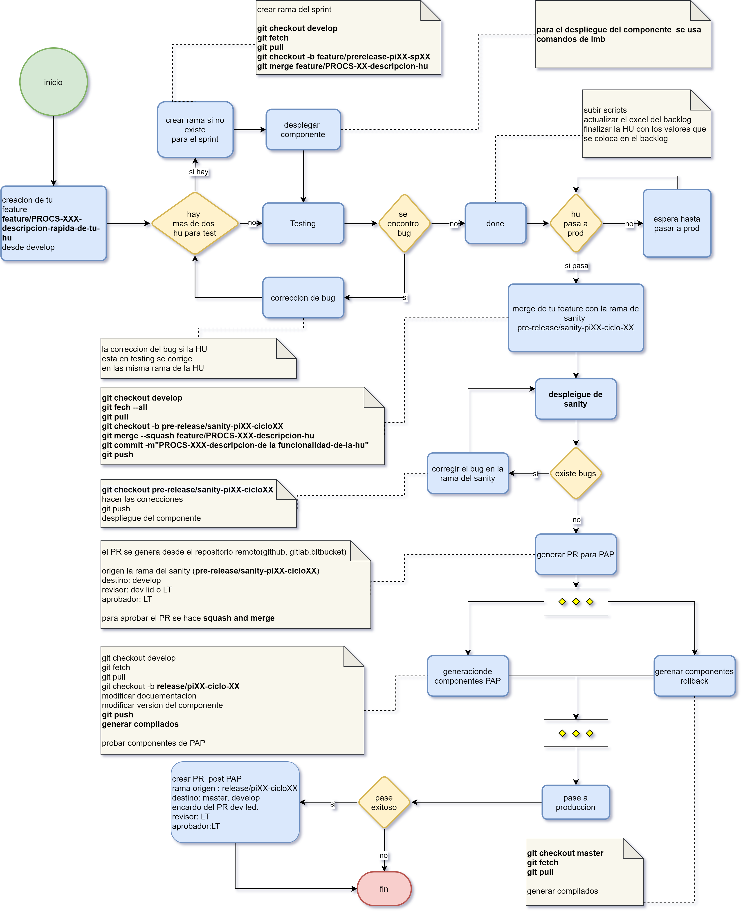
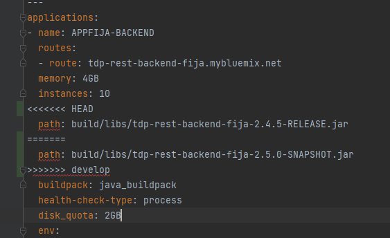

# Gitflow Tdp
## Flujo


## Comandos basicos

````shell
git fetch
git pull 

git merge feature/branch_name
git merge --squash feature/branch_name

git rebase
git rebase -i HEAD~3
git cherry-pick branch_name or sha_commit 

git  checkout feature/branch_name
git  checkout -b feature/branch_name
git commit -m"fix: Descripcion corta del cambio"
git commit -am "doc: Descripcion corta del cambio"
git commit --ammend
git reflog

git stash 
git stash pop
git stash list

 git diff branch1..branch2

````

## Resolucion de conflictos
Se identifica dos partes en un conflicto
el primero seria los cambios que existe en la rama actual

que va desde `<<<<HEAD` hasta `=========`


el segundo punto seria los cambios entrantes o nuevos

que va desde `=====` hasta `>>>>>nombre_rama o sha_del_commit`

como ejemplo tenemos la image que se esta intentando hacer merge desde `develop` hacia `master`


## Nombre de commits y detalles [doc](https://www.conventionalcommits.org/es/v1.0.0-beta.3/)
fea|fix|doc: descripcion entendible y corta de lo que se hace en el commit 

una lista de punto con el detalle de lo que se hizo en el commit

ejm 

feat: encriptacion de servicios en backend fija

- ecnriotacion del ervicio de login
- se usa un clave publica y privada 
- la la generacion de claves se hace a traves una clase utilitaria que esta en el repositorio [github](www.github.com/repositorio_url)


